# :ghost: 树形结构的遍历

遍历下面代码片段的树形结构

```js
const tree = {
  text: 'A',
  children: [
    {
      text: 'B', children: [
        { text: 'D' },
        { text: 'E' }
      ]
    },
    {
      text: 'C', children: [
        { text: 'F' },
        { text: 'G' },
        { text: 'H' }
      ]
    }
  ]
}
```

## 1. 深度优先遍历



### 1.1 深度优先遍历（递归）

使用**递归**的方式进行深度优先遍历，对当前节点的子节点进行遍历，当子节点有它的子节点时，则进行递归。而不先遍历当前节点的兄弟节点，待当前节点的所有子节点都遍历完毕后才遍历其兄弟节点。简而言之，就是当前的子节点也有子节点就一直递归直至子节点为空，当前节点的递归便结束。

```js
// 深度优先遍历（递归）
function DFSByRecursion(node) {
  let nodes = [] // 存储遍历过的节点
  if (node) {
    nodes.push(node.text) // 存储节点
    const children = node.children || []
    for(let i = 0,len = children.length;i < len;i++) {
      nodes = nodes.concat(DFSByRecursion(children[i]))
    }
  }
  return nodes
}
```

### 1.2 深度优先遍历（栈）

通过**栈**结构来进行深度优先遍历，遵循 **“先进后出”** 的遍历顺序，需要注意的是子节点入栈的顺序是从最右边的节点开始的，因为当所有子节点都入栈后，栈顶的节点就是最左边的子节点，能满足深度优先遍历的顺序。

```js
// 深度优先遍历（栈）
function DFSByStack(node) {
  const nodes = [] // 存储遍历过的节点
  const stack = [] // 存放节点的栈
  if (node) {
    stack.push(node)
    while(stack.length) {
      const node = stack.pop() // 取出栈顶节点
      nodes.push(node.text)
      const children = node.children || []
      for (let len = children.length,i = len - 1;i >= 0;i--) {
        stack.push(children[i])
      }
    }
  }
  return nodes
}
```

## 2. 广度优先遍历



### 2.1 广度优先遍历（队列）

借助**队列**结构来进行广度优先遍历，遵循 **“先进先出”** 的遍历顺序。按从左到右的顺序将子节点入队，对队列进行遍历时就可满足广度优先遍历的顺序

```js
// 广度优先遍历（队列）
function BFSByQueue(node) {
  const nodes = [] // 存储遍历过的节点
  const queue = [] // 借助队列先进先出的结构实现从左到右遍历子节点
  if (node) {
    queue.push(node)
    while(queue.length) {
      const node = queue.shift() // 取出队头节点
      nodes.push(node.text)
      const children = node.children || []
      // 将子节点按从左到右的顺序入队，以便出队的顺序也是从左到右
      for (let i = 0,len = children.length;i < len;i++) {
        queue.push(children[i])
      }
    }
  }
  return nodes
}
```

### 2.2 广度优先遍历（递归）

使用**递归**的方式实现广度优先遍历比**队列**的方式麻烦些。先对当前层级的所有节点，然后收集当前层级节点的所有子节点以便进行递归操作。当所有子节点为空时才推出递归

```js
// 广度优先遍历（递归）
function BFSByRecursion(list) {
  let nextLevelChildren = [] // 下一层级的所有子节点
  let nodes = [] // 存储遍历过的节点
  // 对于根节点需包装为数组
  if (!Array.isArray(list)) {
    list = [list]
  }
  for(let i = 0,len = list.length;i < len;i++) {
    const item = list[i]
    const children = item.children || []
    nodes.push(item.text) // 存储当前层级的遍历过的所有节点
    nextLevelChildren = nextLevelChildren.concat(children) // 添加下一层级的所有子节点
  }
  // 当下一层级还有子节点，则进行递归
  if (nextLevelChildren.length) {
    nodes = nodes.concat(BFSByRecursion(nextLevelChildren))
  }
  return nodes
}
```

## 使用场景

- 深拷贝
- 树形结构扁平化

## 参考文章

- [介绍下深度优先遍历和广度优先遍历，如何实现？](https://github.com/Advanced-Frontend/Daily-Interview-Question/issues/9)
