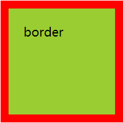
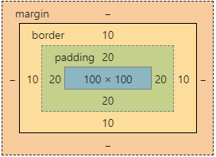
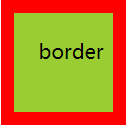
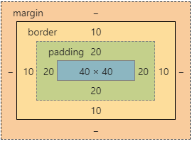

# 盒子模型

在 W3C 标准中，box-sizing 的值有 **`content-box`** 和 **`border-box`**

当我们设置元素的 `box-sizing` 属性为 `content-box` 时，该元素：

width = content 宽度

height = content 高度

```css{4}
width: 100px;
height: 100px;
background-color: yellowgreen;
box-sizing: content-box;
padding: 20px;
border: 10px solid red;
```



而当设置元素的 `box-sizing` 属性为 `border-box` 时，该元素：

width = content 宽度 + 左右 padding + 左右 border

height = content 高度 + 上下 padding + 上下 border

```css{4}
width: 100px;
height: 100px;
background-color: yellowgreen;
box-sizing: border-box;
padding: 20px;
border: 10px solid red;
```


