# 垃圾回收

## 变量的存储

看一小段代码的变量在内存中是如何存储的？

```js
var a = 1
var o = { name: '稻草人' }
function foo() {
  var b = 2
  var c = [1]
}
foo()
```

在内存模型中的存储如下：



JavaScript 中的变量是存储于堆栈中的，所以其垃圾回收就是回收堆栈中的变量

## 回收栈中的垃圾

要回收调用栈中的垃圾是比较容易的，在调用栈中有一个**记录当前执行状态的指针（ESP）**，指向调用栈中当前正在执行的上下文。例如当 foo 函数执行时，**ESP** 指向 foo 执行上下文，而当 foo 函数执行完毕，**ESP** 指针下移指向全局执行上下文，虽然 foo 函数的上下文还保存于栈内存中，但已是无效内存。

## 回收堆中的垃圾

虽然 foo 函数的执行上下文已是无效内存，但保存在堆中的对象依然占用着空间，因此需要回收堆中的垃圾。要回收堆中的垃圾，需要 JavaScript 中的垃圾回收器。

在脚本中，绝大多数对象的生存期很短，只有某些对象的生存期较长，利用这一特点，V8 将堆进行分代，分为**新生代**和**老生代**两个区域，新生代存放生存期较短的对象，通常只有 1-8 M的空间，而老生代存放生存期较长的和较大的对象。

- **副垃圾回收器，回收新生代的垃圾。**
- **主垃圾回收器，回收老生代的垃圾。**

### 垃圾回收器的工作流程

1. 标记空间中活跃对象和非活跃对象
2. 回收非活跃队形所占用的内存，即清理垃圾
3. 内存整理。回收对象后，一般会存在大量不连续的空间，称为**内存碎片**。当内存中出现大量的内存碎片后，如果需要分配较大的连续内存的时候，就可能出现内存不足的情况，因此需要整理内存碎片。

### 副垃圾回收器

副垃圾回收器负责新生区的垃圾回收，大多数小的对象都会被分配到新生区。

由于新生区的垃圾回收频繁，因此使用 **Scavenge** 算法来处理，该算法把新生区划分为两个等大的子区：**对象区域**和**空闲区域**，新加入的对象首先都会被存放到对象区域，当对象区域满时就执行垃圾回收了

首先对对象区域中的不活跃的死对象进行标记，标记完成之后，就进入垃圾清理阶段，副垃圾回收器会将对象区域活跃的对象复制到空闲区域，并且该过程是有序排列的，也就是说在复制过程也完成了内存整理操作。完成复制后，将对象区域和空闲区域交换，至此就完成了垃圾回收。

由于 Scavenge 算法需要将存活的对象从对象区域复制到空闲区域，该操作需要时间成本，若新生代空间设置得太大，那么清理的时间就会较长，所以**为了执行效率，一般新生区的空间会被设置得较小**

由于新生代空间不大，所以很容易被存活的对象占满整个区域。为了解决这个问题，V8 采用了**对象晋升策略**，也就是经过两次垃圾回收依然还存活的对象，会被移动到老生区。

### 主垃圾回收器

主垃圾回收器主要负责老生区的垃圾回收。除了新生区晋升的对象，一些大的对象会直接被分配到老生区。

Scavenge 算法用于快速回收、紧缩小片内存效果很好，但对于大片内存则消耗过大，需要将空间划分为两个子区并且需要复制大对象操作，既浪费内存又执行效率低。因此主垃圾回收器采用**标记-清除（Mark-Sweep）**与**标签-紧缩（Mark-Compact）**算法进行垃圾回收。

首先是标记过程，标记阶段是从一组根对象开始，递归遍历这组根对象，在这个过程中，能到达的对象称为**活跃对象**，不能到达的对象就可以判断为**垃圾对象**。根对象被定义为处于活跃状态，是浏览器或 V8 所引用的对象。例如全局对象属于根对象，因为它们始终可以被访问。

接下来是垃圾的清除过程，清除掉被判断为垃圾对象的对象

由于在垃圾清理过程会产生大量的不连续的内存碎片，导致大对象无法被分配的问题，就需要使用另一种算法**标记-紧缩**来处理，其标记过程与**标记-清理**算法一样，只是在清理时将所有存活的对象都向一端引动，然后直接清理掉端边界以外的内存。

### 增量标记与惰性清理

当一个堆很大且存在很多活跃对象时，标记-清理和标记-紧缩算法会执行的很慢，而在垃圾回收的过程会暂停 JavaScript 线程的执行，也就是说在这个过程中，JavaScript 代码将不会被执行，处理**停顿**状态.

在 2012 年，Google 引入了**增量标记**与**惰性清理**来减少垃圾回收所引起的停顿，增量标记就是将标记过程分为一个个的子标记过程，同时让垃圾回收的标记过程和 JavaScript 执行脚本交替进行，直到标记阶段完成，如此可减少标记-清除和标记-紧缩算法的标记时间。当增量标记完成后，惰性清理就开始了。由于所有的对象已被标记，因此无需一次清理所有的垃圾，垃圾回收器会视需要逐一清理，知道所有的垃圾都清理完毕。

## 参考文章

- 浏览器工作原理与实践-垃圾回收：垃圾数据是如何自动回收的
- [V8 之旅： 垃圾回收器](http://newhtml.net/v8-garbage-collection/)
