# :performing_arts: 执行上下文

执行上下文是指执行 JavaScript 代码的环境，其实就是 JavaScript 代码在执行期间可以访问的值，如 this、变量、对象和函数等

## 1. 执行上下文的类型

- 全局执行上下文

全局执行上下文在程序运行的整个过程中都是可访问的，而且在一个程序中仅有一个全局执行上下文

- 函数执行上下文

当一个函数被调用时，JavaScript 引擎就会为这个函数创建一个新的执行上下文

- eval 函数执行上下文

在 eval 函数中执行的代码也会获得它的执行上下文，由于 eval 函数很少使用，因此在此就先不讨论咯

## 2. 执行栈

我们知道在程序中仅有一个全局执行上下文，而函数执行上下文则可能有多个，那么 JavaScript 引擎是如何管理这些执行上下文的呢？

其实 JavaScript 引擎是借助**执行栈**（也称为**调用栈**）来管理执行上下文的，**执行栈**是一种**先进后出**的栈结构。具体如下工作可参照下面的代码和图：

```html
<script>
function A() {
  console.log('A')
  B()
}

function B() {
  console.log('B')
}

A()
</script>
```



1. 当 JavaScript 引擎遇到 script 脚本时，它将创建**全局执行上下文**并将其推入**执行栈**，然后执行**全局执行上下文**的代码
2. 当 JavaScript 引擎遇到函数（A）被调用时，它将为函数（A）创建新的执行上下文并将其推入**执行栈**的栈顶，然后执行该函数执行上下文的代码
3. 在执行函数（A）代码时，JavaScript 引擎又遇到函数（B）被调用，它又为函数（B）创建新的执行上下文将其他推入**执行栈**的栈顶，然后执行该函数执行上下文的代码
4. 之后函数（B）的执行上下文的代码执行完毕，JavaScript 引擎将该函数执行上下文推出**执行栈**，然后 JavaScript 引擎继续执行函数（A）执行上下文的未执行的代码
5. 当函数（A）执行上下文的代码也执行完毕，JavaScript 引擎也将其推出**执行栈**，然后继续执行全局执行上下文的未执行的代码
6. 当全局执行上下文的代码也执行完毕，最后 JavaScript 引擎将全局执行上下文也推出栈，JavaScript 代码执行结束

## 3. 执行上下文的创建

那么执行上下文是如何创建的呢？

其实执行上下文分为两个阶段

- 创建阶段
- 执行阶段

我们可以先通过一段简单代码和两张图来了解执行上下文是由什么组成的以及这两个阶段都干了什么？

```js
var a
let b = 2
const c = 3

function add(f) {
  var d = 4
  const e = 5
  return c + e + f
}
a = add(b)
```





在创建阶段，JavaScript 引擎会执行以下操作：

1. 创建**词法环境**和**变量环境**，将标识符与变量的关联保存到**词法环境**的**环境记录**中
2. 创建**外部环境引用**，并确定其指向（与作用域链相关）
<!-- 3. 确定 **this** 指向 -->

在创建阶段，JavaScript 引擎处于编译阶段，它只执行以上操作，并不执行代码

而执行上下文的执行阶段则完成了变量的分配（赋值）并执行代码

### 词法环境

在 ES6 官方文档中对于[词法环境](http://ecma-international.org/ecma-262/6.0/#sec-lexical-environments)的定义如下：

> A Lexical Environment is a specification type used to define the association of Identifiers to specific variables and functions based upon the lexical nesting structure of ECMAScript code. A Lexical Environment consists of an Environment Record and a possibly null reference to an outer Lexical Environment

中文意思大概如下：

> 词法环境时一种规范类型，用于根据 ECMAScript 代码的词法嵌套结构来定义标识符与特定变量和函数的关联。词法环境是由环境记录和对外部词法环境的可能为 null 的引用组成

简而言之，词法环境就是保存标识符与变量映射的结构（此处的标识符指的是变量或函数名称，而变量指的是对象类型的引用或原始类型值）

词法环境由两部分组成:

1. 环境记录
2. 外部环境引用（outer）

#### 环境记录

环境记录是一个存储着词法环境里声明的变量和函数的对象（包括 this 绑定的值）

我们平常通过 `let` 和 `const` 以及 `function` 定义的变量和函数就是存储在此。而`var` 声明的变量将被存储于**变量环境的环境记录**里。对于函数执行上下文来说，它的词法环境的环境记录还存储函数的参数 `arguments`

::: tip
`let` 和 `const` 声明的变量在创建阶段只是被创建，还未被初始化，所以变量的值为 `<uninitialized>`，因此在未初始化前访问 `let` 或 `const` 声明的变量则会报错 `Uncaught ReferenceError: Cannot access 'a' before initialization`。

而 `var` 声明的变量在创建阶段会被创建并初始化为 `undefined`，因此可以在声明前访问
:::

#### 外部环境引用（outer）

当 JavaScript 引擎在查找变量时，若在当前的执行上下文中没有找到，则会通过外部环境引用来查找外部环境的词法环境的环境记录里的变量，外部环境引用与**作用域链**相关

例如上述代码中的 add 函数执行上下文的词法环境的外部环境引用就指向全局环境 `<Global>`，若在 add 函数执行上下文中没有找到变量 c，则 JavaScript 引擎就会顺着外部环境引用来查找全局环境的词法环境的环境记录里的变量

#### this 绑定

this 绑定指的是执行上下文中 **this**的指向，**this**的绑定总共有以下几种：

- 浏览器中的全局执行上下文的 **this** 指向 window 对象，而 Node 环境中 **this** 指向 global 对象

  ```js
  console.log(this) // window 对象
  ```

- 函数执行上下文的 **this** 指向函数的调用对象

顺便再此列举函数中 this 指向的可能性

- this 指向调用对象

```js
// 默认指向 window 对象
function add () {
  console.log(this) // window
}
add()
```

```js
// 监听事件时指向触发事件的元素
const btn = document.getElementById('btn')
btn.addEventListener('click', function () {
  console.log(this) // btn html 元素
})
```

```js
// 对象方式调用方法执行调用哦对象
const obj = {
  add: function() {
    console.log(this) // obj 对象
  }
}
obj.add()
```

- call、apply 和 bind 改变 this 指向

```js
// 默认在全局环境中调用函数 this 指向 window
// 通过 call、apply 以及 bind 改变 this 指向
function add () {
  console.log(this)
}
const obj = {}
add.call(obj)

add.apply(obj)

const func = add.bind(obj)
func()
```

- 构造函数的 this 指向其实例

```js
function Person() {
  console.log(this) // person
}
const person = new Person()
```

- 箭头函数 this 指向其定义的环境

```js
const obj = {
  add: () => {
    console.log(this) // window
  }
}
obj.add()
```

### 变量环境

变量环境也是一个词法环境，也就是说变量环境具有和词法环境相同的结构（有环境记录、外部环境引用和 this 绑定），唯一和词法环境不同的是通过 `var` 声明的变量和函数会被记录在变量环境中，而 `let` 和 `const` 声明的变量和函数会被记录在词法环境中

至此，必要的和不必要的名词解释都说明了，那么就继续上面那段代码的执行上下文的分析吧

再来回顾一下：

全局执行上下文经过创建阶段会在词法环境和变量环境中存储声明的变量和函数，后经过执行阶段完成了变量的分配，此时变量 a b c 都可以访问咯，但是此时变量 a 还是 `undefined`

之后 JavaScript 引擎遇到 `add()` 函数调用，就为 add 函数创建执行上下文



函数执行上下文经过创建阶段完成了变量的绑定，外部环境引用指向了**全局对象（window）**（为什么指向了全局对象，请听[作用域链与闭包]()），并且 this 也指向了它的调用者（全局对象）



函数执行上下文经过执行阶段完成了变量的分配并返回值，JavaScript 引擎将 **add 函数执行上下文**推出执行栈，继续执行**全局执行上下文**的代码，将函数 add 的返回值赋值给变量 a。至此，完成代码执行

## 参考链接

- [Understanding Execution Context and Execution Stack in Javascript](https://blog.bitsrc.io/understanding-execution-context-and-execution-stack-in-javascript-1c9ea8642dd0)

- [浏览器工作原理与实践](https://time.geekbang.org/column/article/128427)

- [sec-execution-contexts](http://ecma-international.org/ecma-262/6.0/#sec-execution-contexts)
