# :trident: 原型与原型链

## 1. 原型与原型链

相对于其他通过类继承的设计模式实现继承的语言，JavaScript的继承是通过原型链实现的，该方式仅仅在对象中引入原型属性就实现了继承，更简洁方便

在 JavaScript 中，所有对象都有一个叫做 `[[Prototype]]` 的内部属性，该属性指向此对象的原型，值为 null 或 一个对象。

而所有函数有一个 `prototype` 属性，该属性指向其原型对象。当通过构造函数来创建对象时，其创建的对象的 `[[Prototype]]` 内部属性和构造函数的 `prototype` 属性指向同一个原型对象的。

默认的原型对象是一个只有属性 `constructor` 的对象，该属性指向其构造函数。

由于 `[[Prototype]]` 是内部的属性，我们不能直接访问到该属性，但是有其他方式可以访问或设置它

- **`__proto__`**

通过它可以访问对象的内部属性 `[[Prototype]]`，此属性仅在 ES6 规范中标准化，以确保 Web 浏览器的兼容性，建议获取对象的原型只使用 `Object.getPrototypeOf()`

- **`Object.create(proto[, propertiesObject])`**

创建一个新对象，使用现有的对象来提供新创建的对象的 `__proto__`

- **`Object.setPrototypeOf(obj, prototype)`**

设置一个指定的对象的原型 ( 即, 内部[[Prototype]]属性）到另一个对象或  null。

- **`Object.getPrototypeOf(object)`**

返回指定对象的原型（内部`[[Prototype]]`属性的值）

:::danger 注意
由于现代 JavaScript 引擎优化了属性访问，所以更改对象的 `[[Prototype]]`在*各个*浏览器和 JavaScript 引擎都是一个很慢的操作。在关注性能的情况下，应该避免设置一个对象的 `[[Prototype]]`。相反，应该使用 `Object.create()` 来创建带有你想要的 `[[Prototype]]` 的新对象
:::

为了方便且直观的查看原型，使用 `__proto__` 属性来演示



而**原型链**就是基于以上的关系组成的。一个对象的 `__proto__` 属性指向其原型对象，而这个原型对象也是另一个构造函数创建的对象，因此也有 `__proto__`， 其 `__proto__` 也指向自己的原型对象，层层向上直到一个对象的原型对象为null，而这样的一条原型引用链条就是**原型链**

话不多说，请瞧例子

```js
function Parent(name) {
  this.name = name
}

Parent.prototype.getName = function() {
  return this.name
}

function Child(name, age) {
  Parent.call(this, name)
  this.age = age
}

Child.prototype = Object.create(Parent.prototype)
Child.prototype.constructor = Child
Child.prototype.getAge = function() {
  return this.age
}
const child = new Child('Tom', 18)
console.log(`I am ${child.getAge()}`) // I am 18
console.log(`My name is ${child.getName()}`) // My name is Tom
console.log(`${child.toString()}`)// [object Object]
```

上面的代码使用[寄生组合式继承](#_2-6-寄生组合式继承)实现 Child 继承 Parent

原型链关系图如下：



上图中，将隐藏的原型关系也显示出来了，例如Parent 的原型对象 `Parent.prototype` 的 `__proto__` 指向 `Object.prototype`，这是对象默认的原型对象，原型链的最顶端是 `null`。

其实原型链主要体现在属性和方法的查找上，例如 `child` 实例调用 `getAge` 方法时，自己本身没有该方法，则顺着原型链查找该方法，在 `Child.prototype` 上找到该方法即可调用；而 `getName` 方法则是在 `Parent.prototype` 上找到；而 `toString` 方法则在 `Object.prototype` 上找到。若在原型链上没能找着，则抛出错误

## 2. 继承方式

### 2.1 原型链继承

原型链继承指的是将子类的原型指向父类的实例，以便子类实例可以通过原型访问父类和父类原型的属性和方法

```js {9}
function Parent() {
  this.name = 'Tom'
  this.color = ['red', 'yellow']
}
Parent.prototype.getName = function () {
  return this.name
}
function Child() {}
Child.prototype = new Parent()
const child1 = new Child()
// 可访问父类原型的方法
console.log(child1.getName()) // Tom
// 可访问父类属性
child1.color.push('green')
const child2 = new Child()
// 存在父类引用类型的属性被所有实例共享的问题
console.log(child2.color) // ["red", "yellow", "green"]
```

缺点：

- 父类引用类型的属性被所有实例共享
- 创建子类实例时无法向父类构造函数传参

### 2.2 借用构造函数

借用构造函数实现继承主要是在子类构造函数中调用父类构造函数，以此可将父类属性添加为子类属性

```js {12}
function Parent(name) {
  this.name = name
  this.color = ['red', 'yellow']
  this.getName = function () {
    return this.name
  }
}
Parent.prototype.getColor = function () {
  return this.color
}
function Child(name) {
  Parent.call(this, name)
}
const child1 = new Child('Tom')
child1.color.push('green')
const child2 = new Child('Sun')
// 父类引用类型的属性在子类实例中是独立的
console.log(child2.color) // ["red", "yellow"]

// 父类方法不能复用，每个子类实例都有自己的方法
child1.getName === child2.getName // false
// 不能使用父类原型上的属性和方法
child1.getColor() // Uncaught TypeError: child1.getColor is not a function
```

优点：

- 可在创建子类实例时向父类构造函数传参
- 父类引用类型的属性在子类实例中是独立的

缺点：

- 父类的方法在每个子类实例创建时都会被重新添加，不能做到函数复用而降低效率

### 2.3 组合继承

组合继承指的是将原型链和借用构造函数的技术组合起来从而发挥两者之长的一种继承模式，也是最常用的继承模式

```js {9,12,14}
function Parent(name) {
  this.name = name
}
Parent.prototype.getName = function () {
  return this.name
}
function Child(name) {
  // 调用父类构造函数，继承父类属性
  Parent.call(this, name)
}
// 此处也会调用父类构造函数，以便能访问父类原型的方法
Child.prototype = new Parent()
// 需修正原型的 constructor 属性指向，否则其指向 Parent
Child.prototype.constructor = Child
const child = new Child('Tom')
console.log(child.getName()) // Tom
```

优点：

- 解决了单独使用原型链和借用构造函数继承时的缺点

缺点：

- 父类构造函数被调用了两次，生成了两份父类实例属性

### 2.4 原型式继承

原型式继承跟原型链继承有点类似，不同的是前者是基于**已有的对象**创建新对象，同时还不必创建自定义类型。

ES5 通过新增的 Object.create() 方法规范化了原型式继承

首先创建一个临时构造函数，该构造函数的原型指向传入的对象，最后返回一个实例。返回的实例就可通过原型链访问传入对象的属性和方法

```js {2,3,4}
function object(o) {
  function F() {}
  F.prototype = o
  return new F()
}

const parent = {
  name: 'Tom',
  color: ['red', 'yellow']
}

const child1 = object(parent)
const child2 = object(parent)

// 实例添加 name 属性以便隐蔽父类 name 属性
child1.name = 'Sun'
console.log(child2.name) // Tom
// 存在引用类型的属性被所有实例共享的问题
child1.color.push('green')
console.log(child2.color) // ["red", "yellow", "green"]
```

优点：

- 适用于基于已有的对象的继承，而无需创建构造函数

缺点：

- 存在引用类型的属性被所有实例共享的问题

### 2.5 寄生式继承

寄生式继承是与原型式继承相关的一种模式，它是创建一个仅用于封装继承过程的函数，该函数在内部以某种方式增加对象，最后返回该对象

```js
function object(o) {
  function F() {}
  F.prototype = o
  return new F()
}

function createObject(o) {
  const clone = object(o)
  clone.getName = function () {
    return this.name
  }
  return clone
}

const parent = {
  name: 'Tom',
  color: ['red', 'yellow']
}

const child = createObject(parent)
console.log(child.getName())
```

缺点：

- 同构造函数模式类型，使用寄生式继承为对象添加函数，会由于不能做到函数复用而降低效率

### 2.6 寄生组合式继承

在组合继承中，我们让子类的原型指向父类的实例导致父类构造函数会先被调用一次，而在寄生组合式继承中，通过 `Object.create` 直接将子类的原型指向一个以父类的原型为原型的对象来避免调用再次调用构造函数

```js {8,10,11}
function Parent(name) {
  this.name = name
}
Parent.prototype.getName = function () {
  return this.name
}
function Child(name) {
  Parent.call(this, name)
}
Child.prototype = Object.create(Parent.prototype)
Child.prototype.constructor = Child
const child1 = new Child('Tom')
console.log(child1.getName()) // Tom
```

**`Child.prototype = Object.create(Parent.prototype)` 该行代码所体现的效果是 `Child.prototype.__proto__ = Parent.prototype`。因为 `Object.create` 会创建一个对象，这个对象的 `__proto__` 属性指向 `Parent.prototype`，所以就有 `Child.prototype.__proto__ = Parent.prototype`**

寄生组合式继承被认为是引用类型最理想的继承模式

## 3. ES6 calss 实现原理

ES6 的 `class` 基本上可以看作只是一个语法糖，它的绝大部分功能都可以通过 ES5 来实现，`class` 的写法只是让对象原型的写法更加清晰，更像面向对象编程的语法

ES6 中类的部分特性说明

- **构造方法**：给实例添加属性
- **方法**：类的所有方法都定义在类的原型上面的（除了下面的静态方法），通过类的实例来调用
- **静态方法**：静态方法直接定义在类上面，通过类来调用
- **实例属性的新写法**：可定义在类的最顶层，看上去比较整齐且简洁
- **取值函数（getter）和存值函数（setter）**：在类内部也可以使用 `get` 和 `set` 关键字，对某个属性设置存值函数和取值函数以拦截该属性的存取行为

先看看 ES6 中 `class` 在 ES5 中是如何对应的

```js
class Child {
  // 实例属性的新写法，可定义在类的最顶层
  age = 18
  // 构造方法
  constructor(name) {
    // 实例属性
    this.name = name
  }
  // 取值函数（getter）和存值函数（setter）
  get age() {
    return this.age
  }
  set age(value) {
    this.age = value
  }
  // 原型上的方法
  getName() {
    return this.name
  }
  // 静态方法
  static staticMethod() {
    console.log('I am a static method')
  }
}
```

上面 ES6 的 `class` 对应的 ES5 代码如下（不是被编译后的代码，对应的代码能更好的理解 ES6 中 `class` 与 ES5 中构造函数的对应关系）：

```js
function Child(name) {
  // 实例属性定义
  this.age = 18
  this.name = name
}
Child.prototype = {
  // 取值函数和存值函数
  get age() {
    return this.age
  },
  set age(value) {
    this.age = value
  }
  // 非静态方法定义在原型上
  getName() {
    return this.name
  }
}
// 静态方法定义在构造函数上
Child.staticMethod = function () {
  console.log('I am a static method')
}
```

上面 ES6 代码中的类用babel（V7.10.5） 编译后对应代码如下：

```js
"use strict";

// 检查实例是否是构造函数的实例
function _instanceof(left, right) {
  if (right != null && typeof Symbol !== "undefined" && right[Symbol.hasInstance]) {
    return !! right[Symbol.hasInstance](left);
  } else {
    return left instanceof right;
  }
}

// 检查类是否使用 new 来调用
function _classCallCheck(instance, Constructor) {
  if (!_instanceof(instance, Constructor)) {
    throw new TypeError("Cannot call a class as a function");
  }
}
// 定义方法
function _defineProperties(target, props) {
  for (var i = 0; i < props.length; i++) {
    var descriptor = props[i];
    descriptor.enumerable = descriptor.enumerable || false;
    descriptor.configurable = true;
    if ("value" in descriptor) descriptor.writable = true;
    Object.defineProperty(target, descriptor.key, descriptor);
  }
}

// Constructor：构造器
// protoProps：添加在构造器原型上的方法
// staticProps：添加在构造器上的静态方法
function _createClass(Constructor, protoProps, staticProps) {
  if (protoProps) _defineProperties(Constructor.prototype, protoProps);
  if (staticProps) _defineProperties(Constructor, staticProps);
  return Constructor;
}

// 定义实例属性
function _defineProperty(obj, key, value) {
  if (key in obj) {
    Object.defineProperty(obj, key, {
      value: value,
      enumerable: true,
      configurable: true,
      writable: true
    });
  } else {
    obj[key] = value;
  }
  return obj;
}

var Child =
function() {
  function Child(name) {
    _classCallCheck(this, Child);
    // 对于使用新写法为实例添加属性，会调用_defineProperty来添加属性
    _defineProperty(this, "age", 18);
    this.name = name;
  }
  // 给构造函数的原型添加方法和构造函数添加静态方法
  _createClass(Child, [{
    key: "getName",
    value: function getName() {
      return this.name;
    }
  },
  {
    key: "age",
    get: function get() {
      return this.age;
    },
    set: function set(value) {
      this.age = value;
    }
  }], [{
    key: "staticMethod",
    value: function staticMethod() {
      console.log('I am a static method');
    }
  }]);

  return Child;
} ();
```

ES6 中的 **extends**

```js
class Parent {
  constructor(name) {
    this.name = name
  }
  getName() {
    return this.name
  }
}

class Child extends Parent {
  constructor(name) {
    super(name)
    this.age = 18
  }
}
```

转换后的代码如下：

```js
"use strict";
// 为避免代码过长，删除部分辅助函数。若想查看完整代码，可到 babel 自行转换
// _typeof、_setPrototypeOf、_possibleConstructorReturn、_assertThisInitialized、
// _isNativeReflectConstruct、_getPrototypeOf、_instanceof、_defineProperties

function _inherits(subClass, superClass) {
  if (typeof superClass !== "function" && superClass !== null) {
    throw new TypeError("Super expression must either be null or a function");
  }
  subClass.prototype = Object.create(superClass && superClass.prototype, {
    constructor: {
      value: subClass,
      writable: true,
      configurable: true
    }
  });
  // 子类构造函数继承父类构造函数的静态方法
  if (superClass) _setPrototypeOf(subClass, superClass);
}

function _createSuper(Derived) {
  var hasNativeReflectConstruct = _isNativeReflectConstruct();
  return function _createSuperInternal() {
    var Super = _getPrototypeOf(Derived),
    result;
    if (hasNativeReflectConstruct) {
      var NewTarget = _getPrototypeOf(this).constructor;
      result = Reflect.construct(Super, arguments, NewTarget);
    } else {
      result = Super.apply(this, arguments);
    }
    return _possibleConstructorReturn(this, result);
  };
}

function _createClass(Constructor, protoProps, staticProps) {
  if (protoProps) _defineProperties(Constructor.prototype, protoProps);
  if (staticProps) _defineProperties(Constructor, staticProps);
  return Constructor;
}

var Parent =
/*#__PURE__*/
function() {
  function Parent(name) {
    _classCallCheck(this, Parent);

    this.name = name;
  }

  _createClass(Parent, [{
    key: "getName",
    value: function getName() {
      return this.name;
    }
  }]);

  return Parent;
} ();

var Child =
/*#__PURE__*/
function(_Parent) {
  _inherits(Child, _Parent);

  var _super = _createSuper(Child);

  function Child(name) {
    var _this;

    _classCallCheck(this, Child);

    _this = _super.call(this, name);
    _this.age = 18;
    return _this;
  }

  return Child;
} (Parent);
```

### ES5 与 ES6 继承方式的区别

从上面的转换结果看，ES6 的类继承和 ES5 的寄生组合式继承类似。但是还是有些地方不太一样

- ES5 的继承是先创建子类的实例对象 `this`，然后通过 `Parent.apply(this, arguments)` 将父类的属性添加到 `this` 上。而 ES6 是先创建父类的实例对象 `this` ，子类继承父类的 `this`，然后子类通过构造函数为 `this` 添加属性来达到属性继承

  ToDo: 暂未想通为何是这样的

- 子类的构造函数会继承父类的构造函数的静态方法

在寄生组合式继承子类构造函数是不会继承父类构造函数上的方法的

```js
function _inherits(subClass, superClass) {
  // 同时还将子类构造函数的 __proto__ 指向父类构造函数
  // 以便可以子类可以继承父类的静态方法
  if (superClass) _setPrototypeOf(subClass, superClass);
}
```

## 4. new 实现原理

使用 new 命令创建对象，内部做了啥？

1. 创建一个空对象，作为将要返回的对象实例
2. 将空对象的原型指向构造函数的 `prototype` 属性（因为对象的原型和构造函数的 `prototype` 属性指向同一个原型）
3. 将构造函数的 `this` 绑定为创建的对象并执行构造函数
4. 判断构造函数返回的是否是对象且不等于 null，如果是，则返回该对象，否则返回创建的对象

```js
function _new() {
  // 从参数列表中删除并获取第一个参数（即构造函数）
  const constructor = [].shift.call(arguments)
  // 创建一个原型指向构造函数的 prototype 的空对象
  const obj = Object.create(constructor.prototype)
  // 将构造函数的 `this` 绑定为创建的对象并执行构造函数
  // 这里的 arguments 是除构造函数外的其余参数（构造函数参数在第一步操作时已被删除）
  const result = constructor.apply(obj, arguments)
  // 判断构造函数返回的是否是对象且不等于 null
  return (typeof result === 'object' && result !== null) ? result : obj
}

// Test
function Person(name, age) {
  this.name = name
  this.age = age
}
const obj = _new(Person, 'Tom', 18)
```

## 5. instanceof 实现原理

```js
function _instanceof(left, right) {
  if (typeof left !== 'object' || left === null) return false
  // Object.getPrototypeOf 获取原型，也可以使用 __proto__
  let proto = Object.getPrototypeOf(left)
  while(true) {
    // 到达原型链顶端，则返回 false
    if (proto === null) return false
    // 找到则返回 true
    if (proto === right.prototype) return true
    // 若当前原型对象不对，则让 proto 指向其原型的原型
    proto = Object.getPrototypeOf(proto)
  }
}
const num = new Number(3)
console.log(_instanceof(num, Number)) // true
console.log(_instanceof(num, Object)) // true
```

## 参考文章

- [网道-实例对象与 new 命令](https://wangdoc.com/javascript/oop/new.html)
- JavaScript 高级课程设计（第三版）
- [ES6- Class 的基本语法](https://es6.ruanyifeng.com/#docs/class)
- [ES6- Class 的继承](https://es6.ruanyifeng.com/#docs/class-extends)
- [ES6 系列之 Babel 是如何编译 Class 的(上)](https://github.com/mqyqingfeng/Blog/issues/105)
- [ES6 系列之 Babel 是如何编译 Class 的(下)](https://github.com/mqyqingfeng/Blog/issues/106)