# :fleur_de_lis: 作用域链与闭包

## 1. 作用域

**JavaScript 的作用域指的是变量的可访问性或可见性**。也可以说是在程序的哪里可以访问该变量或者说该变量在何处可见

### 1.1 作用域类型

1. **全局作用域**:
全局作用域中声明的变量在程序中的任何地方都可以被访问

2. **函数作用域**:
函数作用域里声明的变量只在函数内可访问，函数外就访问不了该函数声明的变量

3. **块级作用域**:
在 ES6 中使用 `let` 或 `const` 声明变量时就会产生块级作用域，块级作用域声明的变量只在块内（花括号）内可访问

ToDo: 补充其他块级作用域

```js
{
  let a = 1
}
a // Uncaught ReferenceError: b is not defined
```

### 1.2 词法作用域

词法作用域是什么呢？先来看段代码

```js
const foo = 1
function A() {
  const foo = 2
  B()
}
function B() {
  console.log(foo)
}

A() // 1
```

从上面代码的输出结果看你可能觉得很奇怪。为什么不是输出2呢？

其实这是因为 JavaScript 的作用域是**词法作用域**（也被称为**静态作用域**），**词法作用域**不同于**动态作用域**，前者是无论函数在哪里被调用，也无论它如何被调用，其作用域都只由代码中函数**声明的位置**决定。而后者指的是作用域是在代码执行过程中函数**调用的位置**决定的

### 1.3 作用域链

上面先说明了词法作用域是为了解释作用域链，先来看看作用域链是什么？

其实每个执行上下文的**词法环境**都包含一个**外部环境引用**，其外部环境引用会指向声明该函数时所处的执行上下文的词法环境（为何会指向函数所处的执行上下文的词法环境，是由于 JavaScript 是词法作用域，其作用域是由代码中函数声明的位置决定的）。

外部环境引用的作用就是当 JavaScript 引擎在查找变量时若在当前执行上下文中找不到变量，则会通过外部环境引用去查找外部环境引用指向外部环境的词法环境里的变量，若在外部环境的词法环境中也找不到变量，则继续进行上述步骤去查找直至全局执行上下文的词法环境为止。

由上述变量的查找过程可以得出作用域链的定义，**作用域链就是由词法环境的外部环境引用连接起来的链条**

再来通过一小部分代码片段来分析分析

```js
let a = 1
function first() {
  const b = 2
  function second() {
    const c = 3
    console.log(a + b + c)
  }
  second()
}
first()
```

首先在全局执行上下文中调用 first 函数，然后在 first 函数内调用了 second 函数，在 second 函数内输出了 `a + b + c`，也就是在该执行上下文访问了变量 `a`、`b` 和 `c`，那么接下来就是 JavaScript 引擎查找变量咯。

1）查找变量 `a`：在 second 执行上下文的词法环境中没有找到，由于 second 的执行上下文的词法环境的外部环境引用指向 first 执行上下文的词法环境，因此JavaScript 引擎就去 first 执行上下文的词法环境查找，然后在 first 执行上下文的词法环境也没有找到变量 `a`，则继续通过 first 执行上下文的词法环境的外部环境引用去查找， first 的词法环境的外部环境引用指向全局执行上下文， JavaScript 引擎在全局执行上下文的词法环境中找到变量 `a`，因此变量 `a` 的查找之旅就结束咯。

2）查找变量 `b`：查找变量 `b` 跟 `a` 基本一样，只是变量 `b` 在 first 执行上下文的词法环境中就可以找到

查找变量 `c`：查找变量 `c` 时在 second 的执行上下文的词法环境中3）即可找到，因此无需通过外部环境引用去查找

总的来说，JavaScript 引擎查找变量的过程就是如此咯

再附上一张作用域链图



## 2. 闭包

先给出闭包的定义吧。

**闭包**是一个可以访问**外部作用域**的变量和参数的内部函数，即使在**外部作用域外**的地方也可以访问。

其中**外部作用域**可以是全局作用域、函数作用域或者块级作用域。由此可以得出在 JavaScript 中所有的函数都是闭包，因为创建函数时其所处的外部作用域无外乎一下三种:

- 全局外部作用域

```js
const a = 1
function inter() {
  console.log(a)
}
inter() // 1
```

- 函数外部作用域

```js
function outer () {
  let a = 1
  return inter() {
    console.log(a)
  }
}
outer() // 1
```

- 块级外部作用域

```js
{
  let a = 1
  function inter() {
    console.log(a)
  }
  inter() // 1
}
```

而外部函数返回一个内部函数就是闭包的经典示例

```js
function outer() {
  let a = 1
  return function _inter() {
    console.log(a)
  }
}
const closure = outer()
closure() // 1
```

outer 函数返回了内部函数 _inter ，_inter 函数访问了外部作用域的变量，并且_inter 函数在外部作用域外被调用，_inter 就是**闭包**

### 2.1 实现原理

内部函数在外部作用域内访问其声明的变量比较好理解，那它是如何在外部作用域外还能访问变量呢？这应该得从词法环境说起

在 JavaScript 中，当一个函数被声明时，该函数有对其声明的位置所处的词法环境的引用，也可以说是该函数有个隐藏的属性`[[Environment]]`指向了创建该函数的词法环境的引用，因此内部函数在外部作用域外仍然可以通过该引用来访问外部作用域的变量。

顺便补充一下 **词法环境** 的概念

当脚本、代码块被执行或函数被调用时都会创建一个**词法环境**。词法环境由 **环境记录** 和 **外部环境引用（outer）** 组成，在函数（用函数来说明，脚本和代码块也类似）内声明的变量都会存储在环境记录中，而外部环境引用（outer）会指向该函数声明的位置（这是由 **词法作用域** 决定）

```js
function createCounter() {
  let unused = 'unused'
  let count = 0

  return function() {
    return count++
  }
}

const counter = createCounter();

counter() // 0
```

上述代码中，当调用 `createCounter()` 函数生成 `counter` 函数时，`counter` 函数有个隐藏的属性 `[[Environment]]`，该属性指向了创建该函数时的词法环境的引用，也就是指向了 `createCounter` 函数的词法环境

一般来说当 JavaScript 引擎执行完 `createCounter` 函数后就会将 `createCounter` 执行上下文推出执行栈，所以 `createCounter` 的词法环境也会被回收，因此就访问不了 `createCounter` 函数的词法环境咯，但是由于产生了闭包，JavaScript 引擎会将 `createCounter` 返回的函数的`[[Environment]]` 属性引用的 `{ count: 0 }` 的词法环境保存在内存中

::: tip
只有内部函数访问的变量才有存在于词法环境中，且仅有内部函数才可访问该词法环境
:::

当我们调用 `counter()` 时，会创建一个该函数的新的词法环境，并且其外部环境引用的值取于 `[[Environment]]`

因此在 `counter` 函数在自己的词法环境中找不到变量的话就会通过外部环境引用去查找，而其外部环境引用指向了 `createCounter` 函数的闭包里，因此就可以访问闭包中变量。同时我们也可以更改闭包中的变量的值。

这里仅仅是说明为何内部函数在被外部函数返回后，在其定义的作用域外还可以访问其定义时所处的作用域的变量。

### 2.2 作用

- 封装私有变量

```js
// name 只能通过getName接口来访问
function counter(name) {
  this.getName = function() {
    return name;
  }
}
```

- 模块化

```js
function module() {
  let something = "cool"
  let another = [1, 2, 3]
  function doSomething() {
    console.log( something )
  }
  function doAnother() {
    console.log( another.join( " ! " ) )
  }
}
let module1 = module()
```

### 2.3 实际应用

- 返回函数

```js
function outer() {
  let a = 1
  return function _inter() {
    console.log(a)
  }
}
const closure = outer()
closure() // 1
```

> 在定时器、事件监听器、 Ajax 请求、跨窗口通信、Web Workers 或者任何其他的异步（或者同步）任务中，只要使用了回调函数，实际上就是在使用闭包！ -- 你不知道的JavaScript（上卷）

- 定时器

```js
function outer(message) {
  setTimeout(function _inter() {
    console.log(message)
  }, 1000)
}
outer('timer')
```

outer 函数执行完成后其参数 `message` 还可以被定时器的回调函数访问，因此回调函数 _inter 是闭包，其引用的参数 `message` 在定时器回调执行完成后才被回收

- 事件监听器

```js
function outer() {
  const btn = document.getElementById('btn')
  btn.addEventListener('click', function _inter() {
    console.log(btn)
  })
}
outer()
```

事件监听器的回调也类似，其引用的变量 `btn` 在监听器被移除时才被回收

- IIFE

```js
const a = 2;
(function _inter() {
  console.log(a)
}())
```

## 3. 参考文章

- [发现 JavaScript 中闭包的强大威力](https://juejin.im/post/5c4e6a90e51d4552266576d2)
- [闭包](https://zh.javascript.info/closure#ci-fa-huan-jing)
- [how-do-javascript-closures-work](https://stackoverflow.com/questions/111102/how-do-javascript-closures-work)
- 你不知道的JavaScript（上卷） 第五章 作用域与闭包
