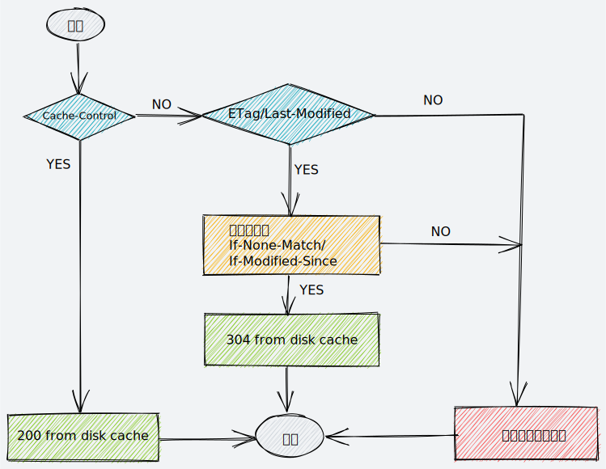

# HTTP 缓存

HTTP 缓存是通过头部字段来控制的，包括**强缓存**和**协商缓存**

## 强缓存

### Expires

**Expires** 是 HTTP/1.0 的规范，其值为一个绝对时间的 GMT 格式的时间字符串，比如: `Expires: Wed, 21 Oct 2020 07:28:00 GMT`。如果发送请求的时间超过 Expires 值，则响应过期。

### Cache-control

**Cache-Control** 是 HTTP/1.1 定义的，用来标记服务器资源有效期的，通过它提供不同的值来定义缓存策略

#### 过期

当 Cache-Control 的值为 `max-age=<seconds>` 时，表示资源能够被缓存的最大时间，max-age 是生存时间（也被称为 "新鲜度"）。相对于 Expires，max-age 时间的计算起点是响应报文的创建时刻（即 Date 字段）是一个相对时间。同时，max-age 也是 HTTP 缓存控制中最常用的属性值。例如 `Cache-Control: max-age=31536000`，表示过期时间为一年

#### 没有缓存

Cache-Control 设置为 `no-store` 时，表示不允许缓存，即缓存中不得存储资源的响应

#### 缓存但重新验证

Cache-Control 设置为 `no-cache` 时，表示缓存会将此请求发到服务器并携带上与本地缓存相关的验证字段，例如 "**If-Modified-Since**"，"**If-None-Match**"，服务器会验证请求中所描述的缓存是否过期，如果未过期，则返回状态码 **304**，表示可使用本地缓存文件。验证资源是否失效需要使用[协商缓存](#协商缓存)

#### 私有与公共缓存

`public` 表示该响应可以被任何中间人（代理服务器，CDN等）缓存。

而 `private` （默认是 private）则表示该响应专用于单个用户的，中间人不能缓存此响应，该响应只能应用于浏览器私有缓存中。

#### 验证方式

当设置为 `must-revalidate` 时，表示如果缓存不过期就可以继续使用，但过期了如果还想使用的话需要去服务器验证。

## 协商缓存

如果本地缓存过期了，需要发送请求到服务器询问该资源是否新鲜，如果服务器验证资源是新鲜的，则返回 304 状态码，无需返回数据，可以节省带宽和减少响应时间；否则会带有该资源的实体内容返回。此过程称为**新鲜度检测**，而实现这种缓存的方式就是**协商缓存**。

协商缓存常用的头字段 “对儿” 有 `If-Modified-Since` 和 `Last-Modified` 以及 `If-None-Match` 和 `ETag`。

服务器需要在第一次响应报文中预先提供 `Last-Modified` 和 `ETag`，然后浏览器在第二次请求相同资源时就可以带上缓存里的 `If-Modified-Since`（值与 `Last-Modified` 相同） 和 `If-None-Match`（值与 `ETag` 相同），服务器验证资源是否是最新的。

### Last-Modified

Last-Modified 表示文件的最后修改时间

**存在的问题**: 例如，一个文件在一秒内修改多次，由于修改时间是秒级的，所以这一秒内的新版本无法区分；再比如，一个文件定期更新，但有时内容实际上并没有变化，服务器就会判断资源为新鲜的，从而响应最新的资源。

### ETag

ETag 表示 "实体标签（Entity Tag）"，**是资源的唯一标识**，主要用来解决修改时间无法准确区分文件变化的问题。

ETag 可以解决 Last-Modified 存在的问题，可以精确地识别资源的变动情况，让浏览器能够更有效地利用缓存。

ETag 有 "**强**" 和 "**弱**" 验证器

强 ETag 要求资源在字节级别必须完全符合，而弱 ETag 在值前有个 "W/" 标记，只要求资源在语义上没有变化，但内部可能有部分发生了变化

## 验证缓存过程

用户操作对缓存的影响

| 用户操作 | Cache-Control | Last-Modified/ETag |
| :-----: |:-------------:| :-----:|
| 前进后退 | 有效 | 有效 |
| 页面链接跳转 | 有效 | 有效 |
| 地址栏回车 | 有效 | 有效 |
| 刷新 | 无效 | 有效 |
| 强制刷新 | 无效 | 无效 |

"刷新" 时，请求头会携带 `Cache-Control: max-age=0`，表示不管响应头如何设置，需要向**服务器验证资源新鲜度**（即验证 ETag/Last-Modified）。而 "强制刷新" 请求头携带 `Cache-Control:no-cache`，表示**本地没有缓存数据**，需要服务器响应最新资源。

"刷新" 时，请求头会携带 `If-Modified-Since` 或 `If-None-Match`，因此协商缓存是有效的。而 "强制刷新" 时，请求头则不会携带 `If-Modified-Since` 或 `If-None-Match`，导致协商缓存不能命中，只能让服务器响应最新的资源。

:::tip
html 外联的css/js 会缓存于 [memory cache](../../browser/browser-cache.html#内存缓存) 中
:::

## 改进资源缓存

> 我们使用缓存的资源越多，网站的响应能力和性能就会越好。为了优化缓存，过期时间设置得尽量长是一种很好的策略。对于定期或者频繁更新的资源，这么做是比较稳妥的，但是对于那些长期不更新的资源会有点问题。这些固定的资源在一定时间内受益于这种长期保持的缓存策略，但一旦要更新就会很困难。特指网页上引入的一些js/css文件，当它们变动时需要尽快更新线上资源。 -- MDN

所以就出现了被 Steve Souders 称为 revving 的技术。即给不频繁更新的文件使用特定的命名方式: URL 后面加上版本号或 hash 或时间戳。只要 URL 不同，那么它们就被视为完全新的独立的资源，同时拥有一年甚至更长的缓存过期时长。而这些版本号或者 hash可由自动化构建工具完成即可，时间戳由 JavaScript 处理即可。

## 参考文章

- [HTTP 缓存](https://developer.mozilla.org/zh-CN/docs/Web/HTTP/Caching_FAQ)
- 20 | 生鲜速递：HTTP的缓存控制
- [HTTP缓存和浏览器的本地存储](https://segmentfault.com/a/1190000020086923)
- [轻松理解浏览器缓存](https://juejin.cn/post/6844904133024022536)
