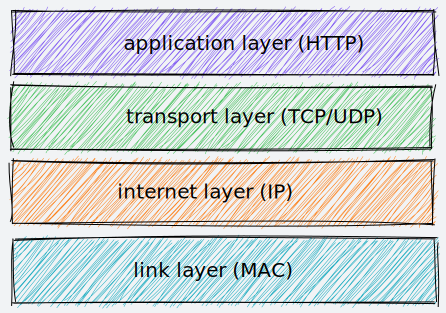
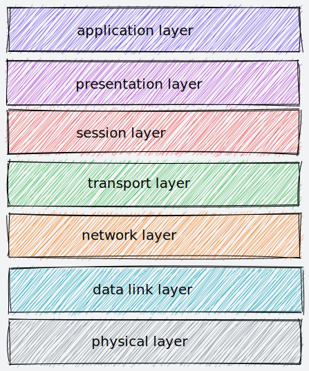
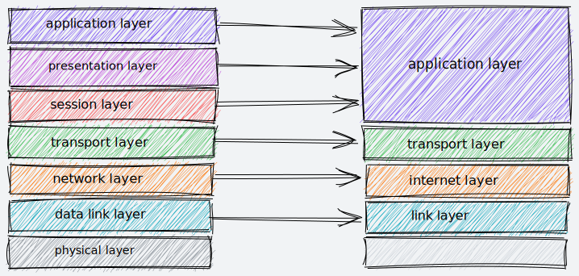

# TCP

> **传输控制协议**（英语：**T**ransmission **C**ontrol **P**rotocol，缩写：**TCP**）是一种面向连接的、可靠的、基于字节流的传输层通信协议，在简化的计算机网络OSI模型中，它完成第四层传输层所指定的功能。-- 维基百科

TCP 、IP 和其他协议共同构成了一个复杂但有层次的协议栈，该协议栈共四层，分层模型如下：

## TCP/IP 网络分层模型

- 第一层是 "**链接层**" （Link Layer）或 "**网络访问层**"（Network Access Layer），负责在以太网、WiFi 这样的底层网络上发送数据包，使用 MAC 地址来标记网络上的设备，有时也称为 MAC 层，传输单位是帧或者数据帧（frame）

- 第二层是 "**网际层**" 或 "**网络互连层**"（Internet Layer)，提供路由和寻址的功能，使两终端系统能够互联。**IP 协议就处于这一层**，由于 TCP/IP 协议体系中的网络层功能有 IP 协议规定和实现，又称为 IP 层，传输单位是包（packet）。在 OSI 模型中称为 "网络层"（Network Layer）

- 第三层是 "**传输层**"（Transport Layer），该层协议的职责是保证数据在 IP 地址标记的两个终端之间 "可靠" 地传输，**TCP 协议就处于这一层**，用于面向连接的传输，传输单位是段（segment）。而无连接的用户数据报协议（UDP）用户简单消息传输。

- 第四层是 "**应用层**"（Application Layer），该层协议是面向具体应用的，有 **HTTP**、HTTPS、FTP、Telnet 等应用层协议，传输单位消息或报文（message）

接下来对照一下 OSI 七层模型

## OSI 网络分层模型

- 第一层是**物理层**，在局部局域网上传输数据帧，它负责管理电脑通信设备和网络媒体之间的互通，例如电缆、光纤、网卡
- 第二层是**数据链路层**，基本相当于 TCP/IP 模型的链接层
- 第三层是**网络层**，对应于 TCP/IP 模型的网际层
- 第四层是**传输层**，对应于 TCP/IP 模型的传输层
- 第五层是**会话层**，维护网络中的连接状态，即保持会话和同步
- 第六层是**表示层**，将数据转换为合适、可理解的语法和语义
- 第七层是**应用层**，面向具体的应用传输数据

## TCP/IP 与 OSI 模型的映射关系

从上图可以看出 OSI 模型:

- 第一层: 物理层在 TCP/IP 无对应
- 第二层: 数据链路层对应 TCP/IP 链接层
- 第三层: 网络层对应 TCP/IP 网际层
- 第四层: 传输层对应 TCP/IP 传输层
- 第五、六、七层: 统一对应到 TCP/IP 应用层

其中 OSI 模型的第五、六、七层对应 TCP/IP 模型应用层是由于 TCP/IP 在实际应用时的会话管理、数据格式定义等和具体应用紧密联系。例如 HTTP 协议就同时包含了连接管理和数据格式定义等。由此可知 TCP/IP 协议栈中的应用层通常会包含 OSI 模型第五、六、七层的功能。

## 总结

## 参考文章

- 透析 HTTP 协议-02 破冰篇-05 常说的“四层”和“七层”到底是什么？“五层”“六层”哪去了？
